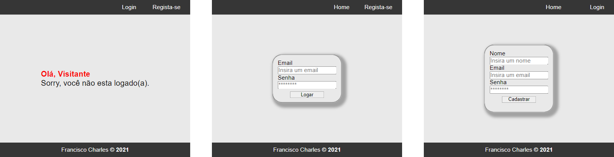

<p align="center">
  <h1>🛠️🧪 <b>Flask App With Login</b> 🛠️🧪</h1>
  <h6>by <i>FranciscoCharles</i></h6>
</p>
<p align="justify">

Este projeto basico é o resultado do estudos de algumas funcionalidades do micro framework **Flask** do **Python**. O principal objetivo foi entender alguns conceitos utilizados além de conhecer como um projeto flask deve ser organizado, puxando a questão de organização e arquitetura.

</p>

<div align="center">
    
    <br>
    <h6>
        Figure 1 - principais telas.
    </h6>
</div>
<div align="center">
    
    <br>
    <h6>
        Figure 2 - tela quando logado e telas com alguns erros.
    </h6>
</div>

# <a name=index>Indice📚</a>
- [**Como executar?**](#run)
- [**Dependências**](#dependencies)
- [**Versão**](#version)
- [**Licença**](#license)

# **<a name=run> ⚙️ Como executar? 🧠💭</a>** <h6>[voltar ao indice](#index)</h6>

 Faça o download do projeto, entre na pasta `src` e instale as dependências com o seguinte comando:
 ```bash
pip install -r requirements.txt
```
 renomeie o arquivo `example-settings.toml` para `settings.toml` e faça as devidas configurações.
 
 Além disso atente-se que nesse arquivo de configuração deve-se preencher os atributos **DB_CONNECTOR**, **DB_USER**, **DB_PASSWORD**,**DB_URL**,**DB_NAME**, todos serão utilizados para construir um URL de acesso  no seguinte formato 
 `{DB_CONNECTOR}://{DB_USER}:{DB_PASSWORD}@{DB_URL}/{DB_NAME}`, se desejar é possivel alterar o código para se adequar ao seu banco desejado.

 Após realizar as configurações, crie o banco de dado e as tabelas usando o seguinte comando:
 ```bash
 flask create-db
 ```
 ⚠️ obs: para esse comando seu usuário deve possuir previlégio de criação de bancos e tabelas.⚠️
   
 Caso deseje é possivel usar o comando abaixo para criar automaticamente 2 usuarios de exemplo para testar o projeto.
 ```bash
 flask populate-db
 ```
 Após esse comando estará disponivel dois usarios com emails sendo `joel@example.com` e `ellie@example.com`, ambos usam a senha `123`.

Tambem está disponivel um comando para deletar as tabelas, use o seguinte comando para esse proposito:

```bash
flask drop-db
```
para executar utilize o comando abaixo:
```bash
flask run
```
Após esse comando o servidor de desenvolvimento será iniciado e basta acessar o endereço `localhost:3000`(caso o `.env` não tenha sido modificado) em qualquer navegador de sua preferência.

# **<a name=dependencies>Dependências</a>**  <h6>[voltar ao indice](#index)</h6>

- [**Flask**](https://pypi.org/project/Flask/) **>= 2.0.2**
- [**Flask-login**](https://pypi.org/project/Flask-Login/) **>= 0.5.0**
- [**Flask-SQLAlchemy**](https://pypi.org/project/Flask-SQLAlchemy/) **>= 2.5.1**
- [**Dynaconf**](https://pypi.org/project/dynaconf/) **>=3.1.7**
- [**Toml**](https://pypi.org/project/toml/) **>=0.10.2**

# **<a name=version>Versão</a>**  <h6>[voltar ao indice](#index)</h6>
- versão atual do projeto: 0.1.1.

# **<a name=license>Licença</a>**  <h6>[voltar ao indice](#index)</h6>

Para mais informações sobre a licença deste projeto, leia o arquivo <a href="./LICENSE" title="go to license file">LICENSE</a>.

---
<p align="center">
    Copyright © 2021 <b>FranciscoCharles</b>
</p>